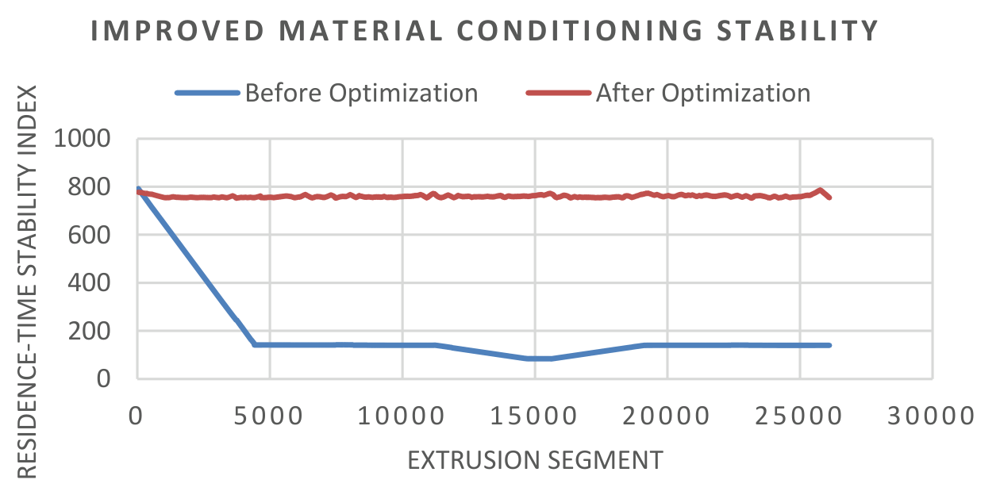
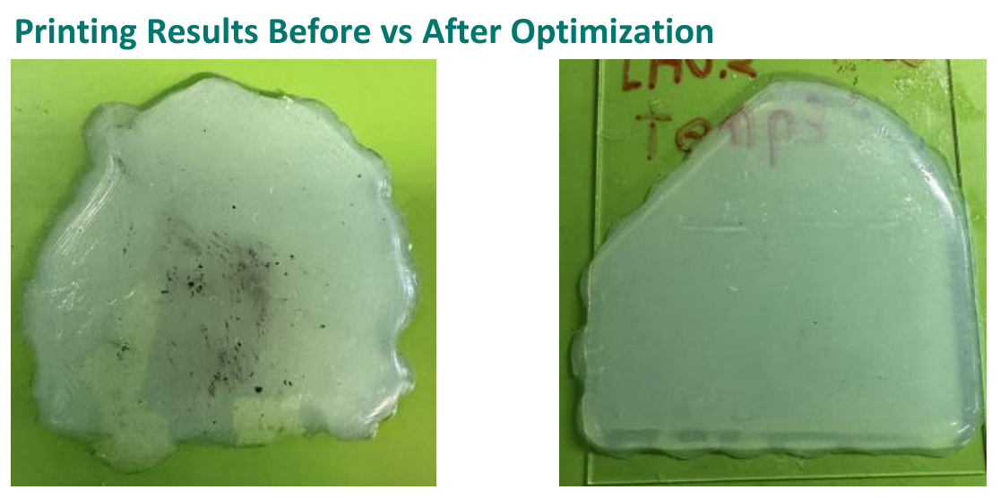

## Project Documentation

- **Illustrated Overview:** [Explore the project with figures and explanations](https://github.com/IEn-Lee/Research-Assistant_Software-Enabled-Additive-Manufacturing-with-Low-Viscosity-Silicone/blob/main/Silicone%20Additive%20Manufacturing%20Portfolio.pdf) 
*(If GitHub fails to display the PDF preview, please download the file and open it locally)*

---

# RTV-2 Silicone G-code Optimizer

A Python tool to convert FDM-style G-code into RTV-2 silicone-compatible toolpaths, with curing-aware optimization.

# Model-Based Optimization of Silicone Additive Manufacturing

**Student Research Assistant — I-En Lee**  
Institute for Factory Automation and Production Systems (FAPS)  
Friedrich-Alexander-Universität Erlangen-Nürnberg (FAU)

## Overview

This research focused on improving **extrusion-based additive manufacturing with low-viscosity silicone** through process modeling, software-based optimization, and experimental validation.

My work connected material residence time and thermal history to changes in material behavior, using these relationships to improve material conditioning consistency and printing performance.

## My Contributions

- Developed a model to track material residence time during extrusion.
- Modeled changes in material behavior associated with residence time and thermal history.
- Implemented model-based process optimization software incorporating PID-based optimization.
- Conducted printing experiments to evaluate the optimized process.
- Validated the optimization software through comparisons of process behavior and printed samples.

## 1. Improving Consistency During Extrusion

A key objective was to maintain more consistent material conditions throughout the printing process. Variations in residence time and thermal history can affect the state of the silicone as it reaches the extrusion outlet, influencing flow behavior and print quality.

I developed a predictive process-modeling framework and applied PID-based optimization to improve consistency across extrusion segments.

  

*Figure 1. Comparison of the residence-time stability index across extrusion segments before and after optimization.*

The comparison shows two different process behaviors:

- **Before optimization (blue):** The index drops substantially from its initial value and changes further during the printing sequence.
- **After optimization (red):** The index remains within a comparatively narrow band across the illustrated extrusion segments.

The optimized profile indicates more consistent material conditioning over the printing sequence, supporting the objective of reducing extrusion instability.

## 2. Evaluating the Printed Results

To evaluate how the process optimization translated into practical printing outcomes, I conducted printing tests and compared the resulting silicone samples.

  

*Figure 2. Silicone samples before optimization (left) and after optimization (right).*

The sample produced **before optimization** shows a more irregular outline and uneven spreading. The sample produced **after optimization** has a more regular shape and more clearly defined edges.

This visual comparison complements the process-stability results in Figure 1: the optimized process produced both a more consistent stability-index profile and an improved printed shape in the illustrated comparison.

## Outcome

The work combined **process modeling, optimization software, and physical printing experiments** to improve silicone extrusion printing.

The main outcomes were:

- Improved material conditioning consistency.
- Reduced extrusion instability during printing.
- Improved shape regularity in the illustrated printed sample.
- Experimental validation of the model-based optimization software.
- A foundation for further process optimization in silicone additive manufacturing.

**Core skills:** Process modeling · Embedded/process control concepts · PID-based optimization · Software development · Silicone additive manufacturing · Experimental validation

---------------------------------------------------------------------------------------------------------------------------------------------------------------------------------------------------------------------------

## Silicone Additive Manufacturing

Here will give some background knowledge of Silicone Additive Manufacturing:
1. what is Silicone Additive Manufacturing
2. advantages of Silicone Additive Manufacturing
3. limitations of existing systems
4. what the different & advantage of F400

(perhaps another Wiki?)

## RTV-2 Silicone

Giving overview and detailed information of RTV-2 Silicone.
1. Background knowledge of RTV-2
2. advantages of RTV-2
3. potential benefits of RTV-2 in additive manufacturing

(perhaps another Wiki?)
